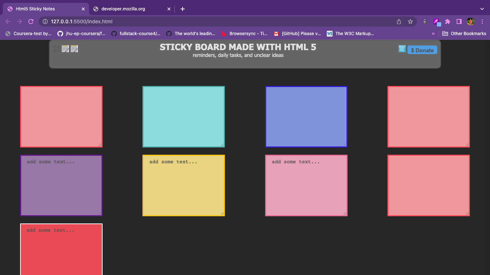

# Practice Question - Module 4 Css Introduction of Stutern Courses Cohort 1.4

This is a solution to the HTML 5 sticky Notes with HTML & CSS [See Practice Question Link](https://docs.google.com/document/d/1DgasTLE8x3o49Ko1WDvJihfdhbOgBO18Ly_J9xhcczc/edit)

### ScreenShot

### Links

- Site URL: [live site](https://amis-stickynotes.netlify.app/)

## Process

### Project is Built with

- Semantic HTML5 markup
- CSS custom properties
- Css Flexbox
- Mobile First design layout

### Goals of project

- To Practice Git Collaboration Workflow
- To Improve understanding of Git Version Control
- To Improve Front-end Skills
- To practice Team work between developers

## Author

- Amina Yahaya Baba - Group one SWE Cohort 1.4
- LinkedIn - [Amina Yahaya](https://www.linkedin.com/mwlite/in/yaminajrfrontend020297)

## Contributors & collaborators

- Olaide Alabi - [Github @holayide](https://github.com/holayide)
- Rachel Opuba - [Github @rachelopuba](https://github.com/RachelOpuba)
- Rita Adedolapo Bamigbola - [Github @RITAADEDOAPO](https://github.com/RITAADEDOLAPO)
- Onadeko Oluwateniola - [Github @teniolalilian ](https://github.com/teniolalilian)
-
-
